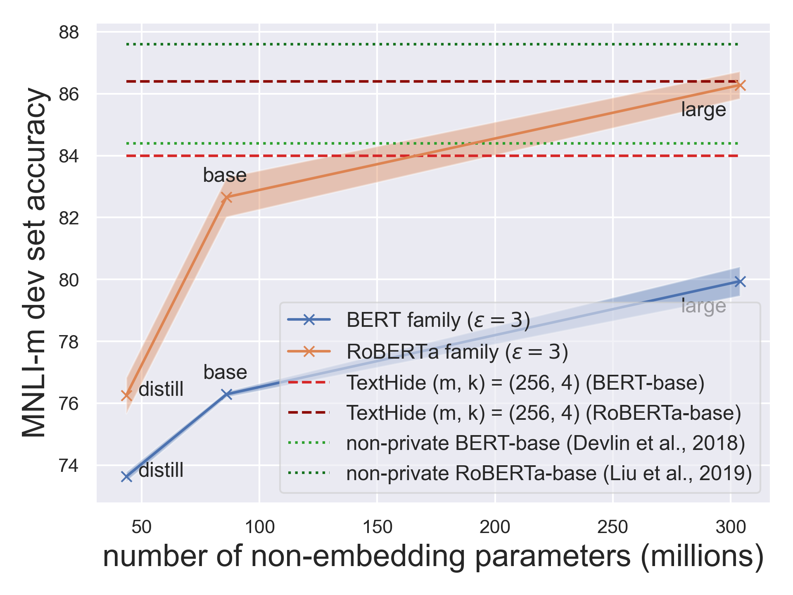
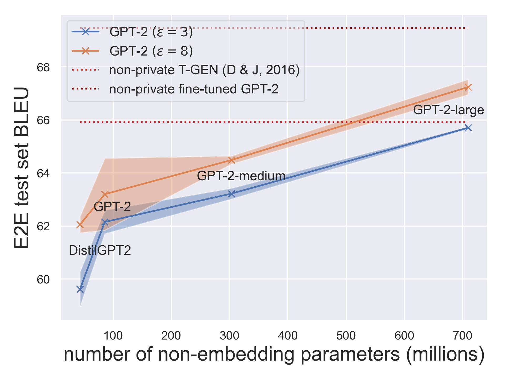

Differential Privacy (DP) is a formal definition of privacy which guarantees that the outcome of a statistical procedure does not vary much regardless of whether an individual input is included or removed from the training dataset. 
This guarantee is desirable when we are tasked to train machine learning models on private datasets that should not memorize individual inputs. 
Past works have shown that differentially private models can be resilient to strong membership inference [[1](https://proceedings.mlr.press/v37/kairouz15.html), [34](https://ieeexplore.ieee.org/abstract/document/9519424), [35](https://proceedings.neurips.cc/paper/2020/hash/fc4ddc15f9f4b4b06ef7844d6bb53abf-Abstract.html)] and data reconstruction attacks [[2](https://www.usenix.org/conference/usenixsecurity19/presentation/carlini), [3](https://arxiv.org/abs/2201.12383)] when the privacy parameter is set to be sufficiently small. 
See a [prior post](https://differentialprivacy.org/how-to-deploy-ml-with-dp/) for more background on differentially private machine learning.

Yet, in practice, most attempts at training differentially private deep learning models on moderately-sized datasets have resulted in large performance drops compared to when training without privacy-protection baked in. 
These performance drops are oftentimes large enough to discourage the adoption of differential privacy protection into machine learning pipelines altogether. 

To provide a reference of the potential performance hit, the authors of [[5](https://arxiv.org/abs/2102.12677)] trained a ResNet-20 from scratch on CIFAR-10 with a privacy budget of \\\(\epsilon=8\\\) that has test accuracy barely over 62% (see their Table 1). 
Contrast this with the 8.75% error rate (91.25% accuracy) reported for training the same architecture without enforcing differential privacy [[6](https://openaccess.thecvf.com/content_cvpr_2016/html/He_Deep_Residual_Learning_CVPR_2016_paper.html)]. 
While some works report private learning results better than the above, absent additional data, pre-training, or external knowledge, most improvements have been incremental, and the test accuracy for CIFAR-10 models trained under modest privacy leakage (\\\(\epsilon=3\\\)) has roughly settled to ~70% in the literature [[4](https://arxiv.org/abs/2011.11660)]. 

One reason behind the performance drop lies in sample efficiency — differentially private learning generally requires much more data than non-private learning to reach an acceptable level of performance. 
This also means that learning the high-level features (e.g., syntactic structure in text, edge detectors for images) necessary to perform specific tasks with private data can be much more sample-costly. 

This blog post surveys results that leverage public self-supervised pre-training to obtain high-performing models through differentially private fine-tuning.
The pre-train-fine-tune paradigm is straightforward to execute and results in high-performing models under modest privacy budgets for many standard computer vision and natural language processing tasks. 
Moreover, existing results have shown that private fine-tuning consistently benefits from improvements in public pre-training. 

## Self-Supervised Pre-Training

Self-supervised learning is a paradigm which leverages unlabeled data to learn representations that can be useful for a range of downstream tasks.
Since self-supervised learning doesn't target specific tasks itself, 
the (pre-)training procedure doesn't require labeled data — in many cases, mildly curated unlabeled data is sufficient for self-supervised pre-training to produce models for subsequent fine-tuning. 
So far, there have been two broadly successful instantiations of this learning paradigm in computer vision [[9](http://proceedings.mlr.press/v119/chen20j.html)] and natural language processing [[7](https://www.cs.ubc.ca/~amuham01/LING530/papers/radford2018improving.pdf), [8](https://arxiv.org/abs/1810.04805)]. 
We recap the two approaches below.[^1]

**Contrastive pre-training for vision:** 
One class of self-supervised methods in computer vision (SimCLR, [[9](http://proceedings.mlr.press/v119/chen20j.html)]) performs pre-training through contrastive learning. 
Algorithms of this type produce embeddings for images with the goal of creating different embeddings for semantically different images and similar embeddings for similar ones. 
Concretely, the algorithm used in SimCLR forces models to produce similar embeddings for an image and its augmented siblings (e.g., image rotated by some degrees), 
and different embeddings for separate images (and their augmentations). 
The SimCLR framework with large scale models and compute led to state-of-the-art (non-private) ImageNet fine-tuning results at the time of its writing. 

**Masked language modeling and autoregressive language modeling for text:** 
Masked Language Modeling (MLM) and Auto-regressive Language Modeling (ALM) are two self-supervised pre-training approaches. 
While the former asks models to predict deliberately masked out tokens from a piece of text, the latter asks models to simply predict the next token in a sequence. 
With large amounts of unlabeled text data, large and expressive Transformer models [[24](https://proceedings.neurips.cc/paper/2017/hash/3f5ee243547dee91fbd053c1c4a845aa-Abstract.html)], and lots of compute, both approaches produce powerful models that are good starting points for downstream fine-tuning. 
For instance, Bidirectional Encoder Representations from Transformers (BERT, [[8](https://arxiv.org/abs/1810.04805)]), produced state-of-the-art (non-private) results (at the time) for a large collection of language understanding tasks when fine-tuned on each. 

## Fine-Tuning Self-Supervised Models With DP-Optimization
Self-supervised pre-training is appealing in the context of differentially private machine learning. 
This is because (i) the mildly curated data needed for pre-training can usually be obtained cheaply from the public domain, and (ii) pre-trained models may contain useful domain knowledge that can reduce the sample complexity of subsequent private learning. 
A paradigm for private learning that leverages self-supervised pre-training could follow two steps:

- collect cheap and public (unlabeled) data from the task domain (e.g., vision, language, etc.) to pre-train a model with self-supervised learning, and
- collect moderate amounts of task-specific private (labeled) data and fine-tune the pre-trained model under differential privacy to perform the task.[^2]

To date, some of the best differentially private deep learning results in the literature have resulted from instantiating this paradigm [[4](https://arxiv.org/abs/2011.11660), [11](https://arxiv.org/abs/2110.05679), [12](https://arxiv.org/abs/2110.06500)].
Below, we review works which capitalize on self-supervised pre-training by differentially privately fine-tuning pre-trained models with an iterative gradient method like DP-SGD [[19](https://dl.acm.org/doi/abs/10.1145/2976749.2978318), [20](https://ieeexplore.ieee.org/abstract/document/6736861)].[^3]

**Private fine-tuning with SimCLR features:** 
The authors of [[4](https://arxiv.org/abs/2011.11660)] fine-tuned a linear model on top of the embedding vectors produced by SimCLRv2 from the CIFAR-10 dataset. Under a privacy budget of \\\(\epsilon=2\\\), 
these models reached an average test accuracy of 92.7%. This number can be further improved to ~94% with the use of larger and wider pre-trained models in the SimCLRv2 family.[^4] 
These test accuracies are very close to some standard non-private results attained by an off-the-shelf ResNet architecture [[6](https://openaccess.thecvf.com/content_cvpr_2016/html/He_Deep_Residual_Learning_CVPR_2016_paper.html)]. 

**Privately fine-tuning BERT variants and GPT-2:** 
The authors of [[11](https://arxiv.org/abs/2110.05679), [12](https://arxiv.org/abs/2110.06500), [16](http://proceedings.mlr.press/v139/yu21f.html)] showed that with appropriate hyper-parameters, fine-tuning BERT variants and GPT-2 with DP-optimization results in high-performing private models for text classification and language generation — even on datasets of modest sizes and under modest privacy budgets. 
Notably, some of these models attain a task performance close to non-private models from previous years in the literature. 
These results also exceed many non-private learning results from the pre-BERT and pre-GPT years.[^5]

More interestingly, the authors showed that the larger (and thus better) the pre-trained model, the better the private fine-tuning performance gets. 
This empirical observation in private fine-tuning of large Transformers is qualitatively different from what’s implied by the usual minimax optimal rates derived for vanilla private learning with convex loss functions under approximate differential privacy [[14](https://ieeexplore.ieee.org/abstract/document/6979031), [15](https://proceedings.neurips.cc/paper/2019/hash/3bd8fdb090f1f5eb66a00c84dbc5ad51-Abstract.html)]. 
This discrepancy between experimental results for training large models and the theory for learning with convex losses suggests there is more to be understood.[^6]

Overall, for both vision and language tasks, private learning performance has consistently improved with the improvement in the quality of pre-training, 
where the latter is measured by the non-private fine-tuning performance.[^7]

  
   
  <caption>Figure 1: Privately fine-tuning better (and larger) pre-trained models lead to consistently improving performance for text classification and language generation. 
Left: text classification on MNLI <a href="https://arxiv.org/abs/1704.05426">[25]</a>. Right: language generation on E2E <a href="https://arxiv.org/abs/1706.09254">[26]</a>.</caption>

## Conclusion and Outlook

We surveyed recent works in the literature that obtained highly performant private machine learning models leveraging self-supervised pre-training. 
Common to these results is the trend that the performance of private learning consistently improved with the quality of public pre-training. 
We therefore anticipate that the general paradigm may be useful in additional settings (e.g., federated learning) and tasks (e.g., private synthetic image generation), and lead to better private learning results. 

We have thus far assumed that the data for public pre-training can be cheaply obtained.
This, however, does not imply that determining whether a particular source of data is appropriate for public pre-training is an easy problem.
Using publicly available data is not necessarily risk-free in terms of privacy.
For instance, the authors of [[33](https://www.usenix.org/conference/usenixsecurity21/presentation/carlini-extracting)] were able to extract personally identifiable information from a GPT-2 model pre-trained on data scraped from the public internet.

Self-supervised pre-training has led to progress in private deep learning, but leveraging pre-trained models alone will not address several fundamental challenges to differentially private learning.
First and foremost, the datasets of machine learning tasks may be sampled from long-tailed distributions [[21](https://proceedings.neurips.cc/paper/2020/hash/1e14bfe2714193e7af5abc64ecbd6b46-Abstract.html)]. 
When privately trained on such datasets, a machine learning model may fail to acquire the learning signal necessary to perform accurate predictions for examples on the tail [[28](https://dl.acm.org/doi/abs/10.1145/3442188.3445934)] or from underrepresented (sub)populations [[29](https://proceedings.neurips.cc/paper/2019/hash/fc0de4e0396fff257ea362983c2dda5a-Abstract.html)]. 
Second, many machine learning problems are in a domain where public data (even unlabeled data) may be sparse, e.g., medical imaging. 
Developing refined versions of the pre-train-fine-tune approach for problems from these domains is an interesting avenue for future work.

Lastly, differential privacy as one specific definition of privacy may not capture all that’s desired for privacy in reality. 
For instance, while differentially private algorithms naturally give machine unlearning guarantees [[30](https://ieeexplore.ieee.org/abstract/document/9519428), [32](https://ieeexplore.ieee.org/abstract/document/7163042)], tailored unlearning algorithms tend to have higher capacities of unlearning [[31](https://proceedings.neurips.cc/paper/2021/hash/9627c45df543c816a3ddf2d8ea686a99-Abstract.html)].
In addition, what constitutes a record in the differential privacy framework can oftentimes be unclear. 
Inappropriately defined example boundaries can create correlated records which cause differential privacy guarantees to degrade [[22](https://arxiv.org/abs/1603.01508)].
Moreover, differential privacy guarantees won't directly prevent the inference of private data outside the original context [[23](https://heinonline.org/hol-cgi-bin/get_pdf.cgi?handle=hein.journals/washlr79&section=16)]. 
These are fundamental limitations of differential privacy which improvements to differentially private learning won't touch on.

[^1]: Authors of [[18](https://arxiv.org/abs/2108.07258)] framed these self-supervised models which are trained on broad data at scale that are adaptable to a wide range of downstream tasks as “foundation models.”

[^2]: The idea of privately fine-tuning a publicly pre-trained model certainly isn’t new. One of the first differentially private deep learning papers [[19](https://arxiv.org/abs/1607.00133)] considered an experiment which fine-tuned convolutional nets on CIFAR-10 which were pre-trained on CIFAR-100. Results on privately fine-tuning *self-supervised* models are, on the other hand, more recent. Covering these results is our main focus here.

[^3]: Blue and pink sphere avatars taken from [[18](https://arxiv.org/abs/2108.07258)]. Credit to [Drew A. Hudson](https://cs.stanford.edu/~dorarad/) for making these. 

[^4]: Unpublished result.

[^5]: Hyper-parameters that work well for non-private learning typically aren't those that work best for differentially private learning [[27](https://openreview.net/pdf?id=rJg851rYwH)]. It’s crucial to use a large batch size, a small clipping norm, an appropriate learning rate, and a reasonably large number of training epochs to obtain the mentioned private learning results [[11](https://arxiv.org/abs/2110.05679)]. 

[^6]: In practice, past works have presented mixed results on whether larger models would yield better performance. While some showed that using more filters in a convolutional network can degrade the performance of private learning after some threshold [[27](https://openreview.net/pdf?id=rJg851rYwH)], others showed that a larger model can outperform a smaller model from a different model family [[4](https://arxiv.org/abs/2011.11660)]. Note these results are conditioned on their particular hyperparameter choices. 

[^7]: Since the pre-training data for large language models are oftentimes collected through large scale web scraping (e.g., WebText), a common concern is that some training and test instances for downstream tasks may already appear in the pre-training data. Self-supervised pre-training therefore can give models an opportunity to “see” this data even before they are privately fine-tuned. Authors of [[17](https://d4mucfpksywv.cloudfront.net/better-language-models/language_models_are_unsupervised_multitask_learners.pdf)] confirmed that there is a 1-6% overlap between the test set of many natural language processing tasks and the pre-training data they collected (WebText); these common tasks, however, don't include those studied by authors of [[11](https://arxiv.org/abs/2110.05679)]. The numbers suggest a possibility that existing private fine-tuning results in the literature could be slightly inflated compared to when the pre-training data didn’t contain any instance for any downstream task for which evaluation was performed. 

## Acknowledgements

The authors thank Nicolas Papernot and Gautam Kamath for detailed feedback and edit suggestions. 

---

## References
[1] Rahman MA, Rahman T, Laganière R, Mohammed N, Wang Y. Membership Inference Attack against Differentially Private Deep Learning Model. Trans. Data Priv.. 2018 Apr 1;11(1):61-79.

[2] Carlini N, Liu C, Erlingsson Ú, Kos J, Song D. The secret sharer: Evaluating and testing unintended memorization in neural networks. In 28th USENIX Security Symposium (USENIX Security 19) 2019 (pp. 267-284).

[3] Guo C, Karrer B, Chaudhuri K, van der Maaten L. Bounding Training Data Reconstruction in Private (Deep) Learning. arXiv preprint arXiv:2201.12383. 2022 Jan 28.

[4] Tramer F, Boneh D. Differentially private learning needs better features (or much more data). arXiv preprint arXiv:2011.11660. 2020 Nov 23.

[5] Yu D, Zhang H, Chen W, Liu TY. Do not let privacy overbill utility: Gradient embedding perturbation for private learning. arXiv preprint arXiv:2102.12677. 2021 Feb 25.

[6] He K, Zhang X, Ren S, Sun J. Deep residual learning for image recognition. InProceedings of the IEEE conference on computer vision and pattern recognition 2016 (pp. 770-778).

[7] Radford A, Narasimhan K, Salimans T, Sutskever I. Improving language understanding by generative pre-training.

[8] Devlin J, Chang MW, Lee K, Toutanova K. Bert: Pre-training of deep bidirectional transformers for language understanding. arXiv preprint arXiv:1810.04805. 2018 Oct 11.

[9] Chen T, Kornblith S, Norouzi M, Hinton G. A simple framework for contrastive learning of visual representations. InInternational conference on machine learning 2020 Nov 21 (pp. 1597-1607). PMLR.

[10] Li XL, Liang P. Prefix-tuning: Optimizing continuous prompts for generation. arXiv preprint arXiv:2101.00190. 2021 Jan 1.

[11] Li X, Tramer F, Liang P, Hashimoto T. Large language models can be strong differentially private learners. arXiv preprint arXiv:2110.05679. 2021 Oct 12.

[12] Yu D, Naik S, Backurs A, Gopi S, Inan HA, Kamath G, Kulkarni J, Lee YT, Manoel A, Wutschitz L, Yekhanin S. Differentially private fine-tuning of language models. arXiv preprint arXiv:2110.06500. 2021 Oct 13.

[13] Liu Y, Ott M, Goyal N, Du J, Joshi M, Chen D, Levy O, Lewis M, Zettlemoyer L, Stoyanov V. Roberta: A robustly optimized bert pretraining approach. arXiv preprint arXiv:1907.11692. 2019 Jul 26.

[14] Bassily R, Smith A, Thakurta A. Private empirical risk minimization: Efficient algorithms and tight error bounds. In2014 IEEE 55th Annual Symposium on Foundations of Computer Science 2014 Oct 18 (pp. 464-473). IEEE.

[15] Bassily R, Feldman V, Talwar K, Guha Thakurta A. Private stochastic convex optimization with optimal rates. Advances in Neural Information Processing Systems. 2019;32.

[16] Yu D, Zhang H, Chen W, Yin J, Liu TY. Large scale private learning via low-rank reparametrization. InInternational Conference on Machine Learning 2021 Jul 1 (pp. 12208-12218). PMLR.

[17] Radford A, Wu J, Child R, Luan D, Amodei D, Sutskever I. Language models are unsupervised multitask learners. OpenAI blog. 2019 Feb 24;1(8):9.

[18] Bommasani R, Hudson DA, Adeli E, Altman R, Arora S, von Arx S, Bernstein MS, Bohg J, Bosselut A, Brunskill E, Brynjolfsson E, et al. On the opportunities and risks of foundation models. arXiv preprint arXiv:2108.07258. 2021 Aug 16.

[19] Abadi M, Chu A, Goodfellow I, McMahan HB, Mironov I, Talwar K, Zhang L. Deep learning with differential privacy. InProceedings of the 2016 ACM SIGSAC conference on computer and communications security 2016 Oct 24 (pp. 308-318).

[20] Song S, Chaudhuri K, Sarwate AD. Stochastic gradient descent with differentially private updates. In2013 IEEE Global Conference on Signal and Information Processing 2013 Dec 3 (pp. 245-248). IEEE.

[21] Feldman V, Zhang C. What neural networks memorize and why: Discovering the long tail via influence estimation. Advances in Neural Information Processing Systems. 2020;33:2881-91.

[22] Ghosh A, Kleinberg R. Inferential privacy guarantees for differentially private mechanisms. arXiv preprint arXiv:1603.01508. 2016 Mar 4.

[23] Nissenbaum H. Privacy as contextual integrity. Wash. L. Rev.. 2004;79:119.

[24] Vaswani A, Shazeer N, Parmar N, Uszkoreit J, Jones L, Gomez AN, Kaiser Ł, Polosukhin I. Attention is all you need. Advances in neural information processing systems. 2017;30.

[25] Williams A, Nangia N, Bowman SR. A broad-coverage challenge corpus for sentence understanding through inference. arXiv preprint arXiv:1704.05426. 2017 Apr 18.

[26] Novikova J, Dušek O, Rieser V. The E2E dataset: New challenges for end-to-end generation. arXiv preprint arXiv:1706.09254. 2017 Jun 28.

[27] Papernot N, Chien S, Song S, Thakurta A, Erlingsson U. Making the shoe fit: Architectures, initializations, and tuning for learning with privacy.

[28] Suriyakumar VM, Papernot N, Goldenberg A, Ghassemi M. Chasing your long tails: Differentially private prediction in health care settings. InProceedings of the 2021 ACM Conference on Fairness, Accountability, and Transparency 2021 Mar 3 (pp. 723-734).

[29] Bagdasaryan E, Poursaeed O, Shmatikov V. Differential privacy has disparate impact on model accuracy. Advances in Neural Information Processing Systems. 2019;32.

[30] Bourtoule L, Chandrasekaran V, Choquette-Choo CA, Jia H, Travers A, Zhang B, Lie D, Papernot N. Machine unlearning. In2021 IEEE Symposium on Security and Privacy (SP) 2021 May 24 (pp. 141-159). IEEE.

[31] Sekhari A, Acharya J, Kamath G, Suresh AT. Remember what you want to forget: Algorithms for machine unlearning. Advances in Neural Information Processing Systems. 2021 Dec 6;34.

[32] Cao Y, Yang J. Towards making systems forget with machine unlearning. In2015 IEEE Symposium on Security and Privacy 2015 May 17 (pp. 463-480). IEEE.

[33] Carlini N, Tramer F, Wallace E, Jagielski M, Herbert-Voss A, Lee K, Roberts A, Brown T, Song D, Erlingsson U, Oprea A. Extracting training data from large language models. In30th USENIX Security Symposium (USENIX Security 21) 2021 (pp. 2633-2650).

[34] Nasr M, Songi S, Thakurta A, Papemoti N, Carlin N. Adversary instantiation: Lower bounds for differentially private machine learning. In2021 IEEE Symposium on Security and Privacy (SP) 2021 May 24 (pp. 866-882). IEEE.

[35] Jagielski M, Ullman J, Oprea A. Auditing differentially private machine learning: How private is private sgd?. Advances in Neural Information Processing Systems. 2020;33:22205-16.
