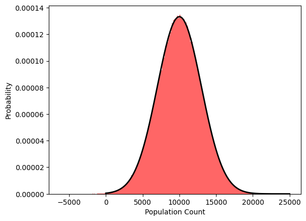

Consider a simple query counting the number of people in various mutually exclusive groups.
In the differential privacy literature, it is typical to assume that each of these groups should be subject to the same privacy loss: the noise added to each count has the same magnitude, and everyone gets the same privacy guarantees.
However, in settings where these groups have vastly different population sizes, larger populations may be willing to accept more error in exchange for stronger privacy protections.
In particular, in many use cases, *relative* error (the noisy count is within 5\% of the true value) matters more than absolute error (the noisy count is at a distance of at most 100 of the true value).
This leads to a natural question: can we use this fact to develop a mechanism that improves the privacy guarantees of individuals in larger groups, subject to a constraint on relative error?

### Problem definition

Our goal is to obtain a mechanism which minimizes the overall privacy loss for each group without exceeding a relative error threshold for each group.
To formalize this goal, we first define a notion of per-group privacy we call group-wise zero-concentrated differential privacy as follows.

**Definition.** *Group-wise zero-concentrated differential privacy.*
Assume possible datasets consist of records from domain \\(U\\), and \\(U\\) can be partitioned into \\(k\\) fixed, disjoint groups \\(U_1\\), \dots, \\(U_k\\). Let \\(v : \mathcal{D} \rightarrow \mathbb{R}^k\\) be a function associating a dataset to a vector of privacy budgets (one per group). We say a mechanism \\(\mathcal{M}\\) satisfies \\(v\\)-group-wise zero-concentrated differential privacy (zCDP) if for any two datasets \\(D\\), \\(D'\\) differing in the addition or removal of a record in \\(U_i\\), and for all \\(\alpha>1\\), we have:
\\[
D_\alpha\left(\mathcal{M}(D||\mathcal{M}(D')\right) & \le \alpha \cdot {v(D)}_i
\\]
\\[
D_\alpha\left(\mathcal{M}(D')||\mathcal{M}(D)\right) & \le \alpha \cdot {v(D)}_i
\\]
where \\(D_\alpha\\) is the Rényi divergence of order \\(\alpha\\).

This definition is similar to *tailored DP*, defined in [[LP15](https://eprint.iacr.org/2014/982.pdf)]: each individual gets a different privacy guarantee, depending on which group they belong to;
this guarantee also depends on how many people are in this group.
We use zCDP as our definition of privacy due to its compatibility with the Gaussian mechanism; the same idea could easily be applied to other definitions like with Rényi DP or pure DP.

From there we can give a more formal definition of the problem as follows. The goal is to minimize the privacy loss for each individual group, while keeping the error under a given threshold.
For larger groups that can accept more noise, this means adding more noise to achieve the smallest possible privacy loss.

**Problem.**
Let \\(r \in (0,1]\\) be an acceptable level of relative error, and \\(k\\) be the number of distinct, mutually-exclusive partitions of domain \\(X\\).
Given a dataset \\(D\\), let \\(x(D)\\) be a vector containing the count of records in each partition.
The objective is to find a mechanism \\(\mathcal{M}\\) which takes in \\(r\\), \\(k\\), and \\(D\\) and outputs \\(\hat{x}(D)\\) such that \\(E\left[\left|{x(D)}_i-{\hat{x}(D)}_i\right|\right]<r\cdot {x(D)}_i\\) for all \\(i\\), and satisfies \\(v\\)-group-wise zCDP where \\(v(D)_i\\) is as small as possible for all \\(i\\).
 
To prevent pathological mechanisms that optimize for specific datasets, we add two constraints to the problem: the privacy guarantee \\(v(D)_i\\) should only depend on \\(x(D)_i\\), and should be nonincreasing with \\(x(D)_i\\).

Since the relative error thresholds are proportional to the population size, each population can tolerate a different amount of noise.
This means that to minimize the privacy loss for each group, the mechanism must add noise of different scales to each group.
Of course, directly using \\(x(D)_i\\) to determine the scale of the noise for group \\(i\\) leads to a privacy loss which is data dependent, similarly to e.g. PATE [[PAEGT17](https://openreview.net/forum?id=HkwoSDPg)], and as such should be treated as a protected value. %Alternatively one could use a private mechanism to measure a noisy version of the true count and determine additional noise using that noisy value.

### An example mechanism

An example mechanism that seems like it could address this problem is as follows.
First, perform the original counting query and add Gaussian noise to satisfy \\(\rho\\)-zCDP.
Then, add additional Gaussian noise to each count, with a variance that depends on the noisy count itself --- adding more noise to larger groups.
This mechanism is outlined in Algorithm 1.

**Algorithm 1.**
*Adding data-dependent noise as a post-processing step.*
 
Require: A dataset \\(D\\) where each data point belongs to one of \\(k\\) groups, a privacy parameter \\(\rho\\), and a relative error rate \\(r\\).
1. *Let* \\(\sigma^2 = 1/(2\rho)\\)
2. **For** \\(i=1\\) to \\(k\\)} **do**
3. \\(\qquad\\) Let \\(x_i\\) be the number of people in \\(D\\) in group \\(i\\)
4. \\(\qquad\\) Sample \\(X_i \sim \mathcal{N}(x_i, \sigma^2)\\)
5. \\(\qquad\\) Sample \\(Y_i \sim \mathcal{N}_{k}(X_i, (rX_i)^2)\\)
6. **end for**
7. **return** \\(Y_1,\dots,Y_k\\)

Algorithm 1 achieves this goal of having approximately \\(r\\) error in each group: the total variance error of the mechanism is \\(\sigma^2 + (rX)^2\\), and \\(X\\) is a zCDP measure of \\(f(D)\\).
This mechanism satisfies at least \\(\rho\\)-zCDP: line 4 is an invocation of the Gaussian mechanism with privacy parameter \\(\rho\\), and line 5 is a post processing step and as such preserves the zCDP guarantee.
We would like to show that this algorithm also satisfies a stronger group-wise zCDP guarantee.

This makes intuitive sense: line 5 adds additional Gaussian noise without using the private data directly.
Since the noise scale in line 5 is proportional to the total count in line 4, we expect the privacy guarantee to be significantly stronger for large groups with more noise.
Further, we can verify experimentally that when the data magnitude is large compared to the noise, the output distribution for each group is close to a Gaussian distribution; a comparison using 1,000,000 sample outputs can be found in Figure 1.

  
  <caption>
    Figure 1: Output distribution of Algorithm 1 (red) over 1M samples with parameters \\(\sigma^2 = 100\\) and \\(r= 0.3\\). Compared to the best fit Gaussian distribution (black outline) with mean \\(10,002.6\\) and standard deviation of \\(2995.1\\).
  </caption>

With parameters such as these, the output of the mechanism looks and behaves like a Gaussian distribution, which should be ideal to characterize the zCDP guarantee.
However, it is difficult to directly quantify this guarantee, due to the changing variance which is also a random variable.
Likewise, if the true count is close to zero or if the first instance of noise is large compared to the true count than the resulting distribution takes on a heavy skew and is no longer similar to a single Gaussian distribution.
Such distributions with randomized variances have not, to the best of our knowledge, been considered much in the literature, and we do not know whether the mechanism's output distribution follows some well-studied distribution.

The randomized variance also makes it difficult to bound the Rényi divergence of the distribution and characterize the zCDP guarantees directly.
Current privacy amplification techniques are insufficient, as those techniques consider adding additional noise where the noise parameters are independent of the data itself.

Perhaps the most promising direction to understand more about such processes is the area of stochastic differential equations, where it is common to study noise with data-dependent variance.
The Bessel process [[Øks03](http://www.stat.ucla.edu/~ywu/research/documents/StochasticDifferentialEquations.pdf)] is an example of such a process, where the noise is dependent on the current value.
This process captures the noise added as post-processing (Line 5), but not the initial noise-addition step (Line 4).
Furthermore, to the best of our knowledge, the Bessel process and other value-dependent stochastic differential equations do not have closed-form solutions.

### Goal

We see two possible paths forward to address the original question. One path would be to obtain an analysis of Algorithm 1 which shows non-trivial improved privacy guarantees for larger groups.
We tried multiple approaches, but could not prove such a result.

An alternative path would be to develop a different algorithm, which achieves better privacy guarantees for larger groups while maintaining the error below the relative error threshold for all groups.
