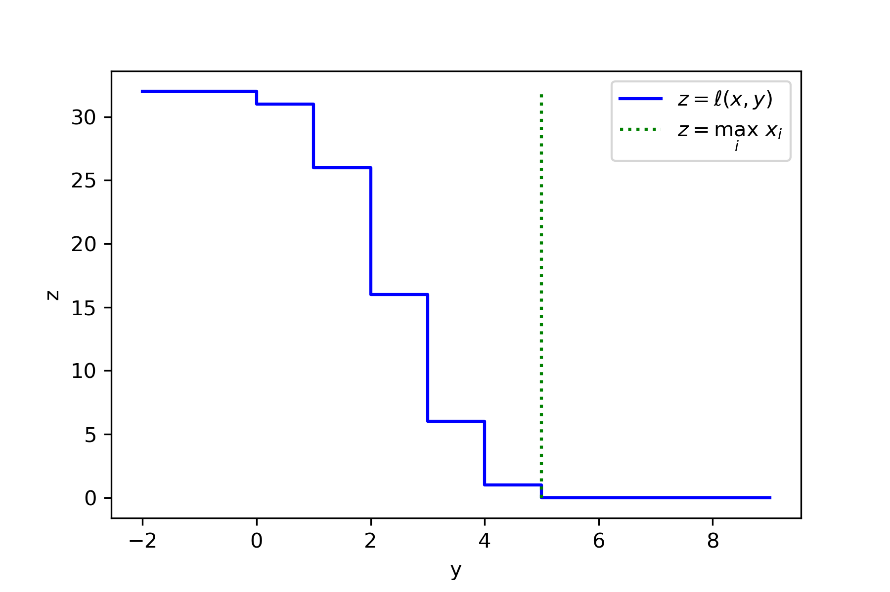

In [our previous post](/inverse-sensitivity/), we discussed local sensitivity and how we can get accuracy guarantees that scale with local sensitivity, which can be much better than the global sensitivity guarantees attained via standard noise addition mechanisms.
In this post we will look at what we can do when even the local sensitivity is unbounded. This is obviously a challenging setting, but it turns out that not all hope is lost.

As a motivating example, suppose we have a dataset \\\(x=\(x\_1,x\_2,\\cdots,x\_n\)\\\) and we want to approximate \\\(\\max\_i x\_i \\\) in a differentially private manner.
The difficulty is that adding a single element to \\\(x\\\) can increase the maximum arbitrarily. That is, if \\\(x'=\(x\_1,x\_2,\\cdots,x\_n,\\infty\)\\\), then \\\(\\max\_i x'\_i=\\infty\\\). Differential privacy requires us to make the outputs \\\(M\(x\)\\\) and \\\(M\(x'\)\\\) indistinguishable, which seems to directly contradict our accuracy goal \\\(M\(x\) \\approx \\max\_i x\_i\\\).

One solution to the problem of unbounded sensitivity is to clip the inputs, so that the sensitivity becomes bounded. But this requires knowing a good a priori approximate upper bound on the \\\(x\_i\\\)s. Trying to find such an upper bound is probably the very reason we want to approximate the maximum in the first place!

Another solution is to "aim lower:" Instead of aiming to approximate the largest element \\\(x\_{\(n\)} := \\max\_i x\_i\\\), we can aim to approximate the \\\(k\\\)-th largest element \\\(x\_{\(n-k+1\)}\\\).
The \\\(k\\\)-th largest element has bounded local sensitivity (up to distance \\\(k-1\\\)), which means we can apply [the inverse sensitivity mechanism](/inverse-sensitivity/) or similar tools.
And -- spoiler alert -- this is essentially what we will do. However, we will present an algorithm that is more general than just for approximating the maximum.

The algorithm we present is due to Fang, Dong, and Yi [[FDY22](https://cse.hkust.edu.hk/~yike/ShiftedInverse.pdf "Juanru Fang, Wei Dong, Ke Yi. Shifted Inverse: A General Mechanism for Monotonic Functions under User Differential Privacy. CCS 2022.")].
In terms of applications, a natural setting where we may need to approximate functions of unbouned local sensitivity is when each person can contribute multiple items to the dataset. This setting is often referred to as "user-level differential privacy" or "user DP."[^1]
For example, if we have a collection of web browsing histories, we may wish to estimate the total number of webpages visited; this has unbounded local sensitivity because a single person could visit an arbitrary number of webpages.

## Down Sensitivity

Observe that, while _adding_ one element to the input can increase the maximum arbitrarily, _removing_ one element can only decrease it by the gap between the largest and second-largest elements \\\(x\_{\(n\)}-x\_{\(n-1\)}\\\). In other words, the maximum satisfies some kind of one-sided local sensitivity bound. This is the general property we will rely on.

We define the \\\(k\\\)-_down sensitivity_[^2] of the function \\\(f : \\mathcal{X}^\* \\to \\mathbb{R}\\\) at the input \\\(x\\in\\mathcal{X}^\*\\\) as
\\\[\\mathsf{DS}^k\_f(x) := \\sup\_\{x' \\subseteq x : \\mathrm{dist}(x,x') \\le k\} \|f(x)-f(x')\|. \\tag{1}\\\]
Here \\\(\\mathrm{dist} : \\mathcal{X}^\* \times \\mathcal{X}^\* \\to \\mathbb{R}\\\) is the size of the symmetric difference between the two input tuples/multisets \\\(\\mathrm{dist}\(x,x'\) = \|x \\setminus x'\| + \| x' \\setminus x \|\\\), which defines a metric. In other words, it measures how many people's data must be added or removed to get from one dataset to the other.
For comparison, the local sensitivity is
\\\[\\mathsf{LS}^k\_f(x) := \\sup\_\{x'\\in\\mathcal{X}^\* : \\mathrm{dist}(x,x') \\le k\} \|f(x)-f(x')\|. \\tag{2}\\\]
The difference between Equations 1 and 2 is simply that down sensitivity only considers removing elements from \\\(x\\\), while local sensitivity considers both addition and removal.
Thus, the down sensitivity is at most the local sensitivity, which is, in turn, upper bounded by the global sensitivity: \\\(\\mathsf{DS}^k\_f(x) \\le \\mathsf{LS}^k\_f(x) \\le k \\cdot \\mathsf{GS}\_f\\\).

Intuitively, what is nice about down sensitivity is that it only considers the actual data we have at hand. It doesn't consider any hypothetical people's data that could be added to the dataset. It is appealing to only have to deal with "real" data.

Our goal now is to estimate \\\(f\(x\)\\\) in a differentially private manner, where the accuracy guarantee scales with the down sensitivity.

## Monotonicity Assumption

In order to do anything, we need some assumptions about the function \\\(f : \\mathcal{X}^\* \\to \\mathcal{Y}\\\) that we are trying to approximate.
First we will assume that \\\(\\mathcal{Y} \subseteq \\mathbb{R}\\\) is finite and surjective.[^3]
The main assumption is monotonicity:
\\\[\\forall x' \\subseteq x \\in \\mathcal{X}^\* ~~~ f(x') \le f(x). \tag{3}\\\]
The maximum and many other example functions satisfy this assumption.

Intuitively, we need this assumption to ensure that the down sensitivity is itself low sensitivity (in terms of the radius \\\(k\\\)).
Specifically, Lemma 1 below requires monotonicity.

As an example of what could happen if we don't make this assumption, consider the function \\\(\mathrm{sum}(x) := \sum\_i x_i\\\) and the pair of neighbouring inputs \\\(x=(1,1,\cdots,1)\in\mathcal{Y}^n,x'=(1,1,\cdots,1,-n)\in\mathcal{Y}^{n+1}\\\). Then, for all \\\(1 \le k\\le n\\\), we have \\\(\mathsf{DS}\_{\mathrm{sum}}^k(x)=k\\\), but \\\(\mathsf{DS}\_{\mathrm{sum}}^k(x')=n\\\).

Note that the sum is monotone if we restrict to non-negative inputs. In general, we can take any function \\\(g\\\) and convert it into a monotone function \\\(f\\\) by defining \\\(f\(x\) = \max\\{ g\(\\check{x}\) : \\check{x} \\subseteq x \\}\\\). Depending on the context, this \\\(f\\\) may or may not be a good proxy for \\\(g\\\).

## A Loss With Bounded Global Sensitivity

Given a monotone function \\\(f : \\mathcal{X}^\* \\to \\mathbb{R}\\\), we define a loss function \\\(\\ell : \\mathcal{X}^\* \\times \\mathbb{R} \\to \\mathbb{Z}\_{\\ge 0}\\\) by
\\\[\\ell(x,y) := \\min\\{ \\mathrm{dist}(x,\\tilde{x}) : \\tilde{x} \\subseteq x, f\(\\tilde{x}\) \le y \\}. \\tag{4}\\\]
In other words, \\\(\\ell(x,y)\\\) measures how many entries of \\\(x\\\) we need to remove to decrease the function value until \\\(f\(x\) \\le y\\\). 
Yet another way to think of it is that \\\(\\ell(x,y)\\\) is the distance from the point \\\(x\\\) to the set \\\(f^{-1}((-\\infty,y]) \\cap \\{ \\tilde{x} : \\tilde{x} \\subseteq x \\} \\\). 

| Figure 1: Visualization of the loss \\\(\\ell(x,y)\\\) corresponding to \\\(f(x)=\\max\_i x\_i\\\) for a dataset representing the distribution \\\(\\mathrm{Binomial}(5,1/2)\\\) i.e. the true maximum is \\\(5\\\) and the dataset is \\\(x=\(0,\\underbrace{1,1,1,1,1}\_{5\times},\\underbrace{2,2,\\cdots,2}\_{10\times},\\underbrace{3,3,\\cdots,3}\_{10\times},\\underbrace{4,4,4,4,4}\_{5\times},5)\\\).|

The key property we need is that this loss has bounded sensitivity. We split the proof into Lemmas 1 and 2.

> **Lemma 1.**
> Let \\\(f : \\mathcal{X}^\* \\to \\mathbb{R}\\\) satisfy the monotonicity property in Equation 3.
> Define \\\(\\ell : \\mathcal{X}^\* \\times \\mathbb{R} \\to \\mathbb{Z}\_{\\ge 0}\\\) as in Equation 4. <br>
> Let \\\(x' \subseteq x \in \mathcal{X}^\*\\\).
> Then \\\(\ell(x',y)\le\ell(x,y)\\\) for all \\\(y \in \mathbb{R}\\\).

> _Proof._
> Fix \\\(y \in \mathbb{R}\\\) and \\\(x' \subseteq x \in \mathcal{X}^\*\\\).
> Let \\\(x\_\\Delta = x \\setminus x' \\subseteq x\\\), so that \\\(x' = x \\setminus x\_\\Delta \\\).
> 
> Let \\\(\\widehat{x} \\subseteq x\\\) satisfy \\\(f\(\\widehat{x}\)\\le y\\\) and \\\(\\mathrm{dist}\(x,\\widehat{x}\)=\\ell\(x,y\)\\\).
> Define \\\(\\widehat{x}' = \\widehat{x} \\setminus x\_\\Delta\\\). This ensures \\\(\\widehat{x}' \\subseteq x'\\\) and \\\[\\mathrm{dist}(x',\\widehat{x}') = \\mathrm{dist}\(x  \\setminus x\_\\Delta , \\widehat{x}  \\setminus x\_\\Delta \) \\le \\mathrm{dist}(x,\\widehat{x}).\\\]
> 
> By monotonicity, \\\(f\(\\widehat{x}'\) \\le f\(x\) \\le y\\\). 
> Thus \\\[\\ell(x',y) = \\min\\{ \\mathrm{dist}(x',\\tilde{x}') : \\tilde{x}' \\subseteq x', f\(\\tilde{x}'\) \le y \\}\\\]\\\[ \\le \\mathrm{dist}(x',\\widehat{x}')  \\le \\mathrm{dist}(x,\\widehat{x}) = \\ell\(x,y\).\\\]
> &#8718;

> **Lemma 2.**
> Let \\\(f : \\mathcal{X}^\* \\to \\mathbb{R}\\\).
> Define \\\(\\ell : \\mathcal{X}^\* \\times \\mathbb{R} \\to \\mathbb{Z}\_{\\ge 0}\\\) as in Equation 4. <br>
> Let \\\(x' \subseteq x \in \mathcal{X}^\*\\\).
> Then \\\(\ell(x,y)\le\ell(x',y)+\mathrm{dist}(x,x')\\\) for all \\\(y \in \mathbb{R}\\\).

> _Proof._
> Fix \\\(y \in \mathbb{R}\\\) and \\\(x' \subseteq x \in \mathcal{X}^\*\\\).
> 
> Let \\\(\\widehat{x}' \\subseteq x'\\\) satisfy \\\(f\(\\widehat{x}'\)\\le y\\\) and \\\(\\mathrm{dist}\(x',\\widehat{x}'\)=\\ell\(x',y\)\\\).
> Since \\\(\\widehat{x}' \\subseteq x' \\subseteq x\\\), we have 
> \\\[\\ell(x,y) = \\min\\{ \\mathrm{dist}(x,\\tilde{x}) : \\tilde{x} \\subseteq x, f\(\\tilde{x}\) \le y \\}  \\le \\mathrm{dist}(x,\\widehat{x}') \\\]\\\[ \\le \\mathrm{dist}(x,x') + \\mathrm{dist}(x',\\widehat{x}') = \\ell\(x,y\)+\mathrm{dist}(x,x'),\\\]
> by the triangle inequality, as required.
> &#8718;

Note that we only needed the monotonicity assumption for Lemma 1. 
Combining the two lemmas gives \\\[ \forall  x' \\subseteq x ~ \forall y ~~~~~ \ell(x',y) \le \ell(x,y) \le \ell(x',y) + \mathrm{dist}(x,x').\\\]
Overall we have the following guarantee.

> **Proposition 3. (Global Sensitivity of the Loss)**
> Let \\\(f : \\mathcal{X}^\* \\to \\mathbb{R}\\\) satisfy the monotonicity property in Equation 3.
> Define \\\(\\ell : \\mathcal{X}^\* \\times \\mathbb{R} \\to \\mathbb{Z}\_{\\ge 0}\\\) as in Equation 4. <br>
> Then, for all \\\(x, x' \\in \\mathcal{X}^\*\\\) and all \\\(y \in \mathbb{R}\\\), we have \\\[\|\ell(x,y)-\ell(x',y)\| \le \mathrm{dist}(x,x').\\\]

> _Proof._
> Fix \\\(x, x' \\in \\mathcal{X}^\*\\\) and \\\(y \\in \\mathbb{R}\\\).
> Let \\\(x'' = x \\cap x'\\\). 
> Since \\\(x'' \\subset x'\\\) and \\\(f\\\) is assumed to be monotone, Lemma 1 gives \\\(\\ell\(x'' ,y\) \\le \\ell\(x',y\)\\\).
> Also \\\(x'' \\subset x\\\), whence Lemma 2 gives \\\(\\ell\(x,y\) \\le \\ell\(x'' , y\) + \\mathrm{dist}\(x , x'' \)\\\).
> Note that \\\( \\mathrm{dist}\(x , x'' \) = \| x \\setminus x'' \| = \| x \\setminus x' \| \\le \\mathrm{dist}\(x , x' \).\\\)
> Combining inequalities gives \\\(\\ell\(x,y\) \\le \\ell\(x' , y\) + \\mathrm{dist}\(x , x' \)\\\). The other direction is symmetric.
> &#8718;

## The Shifted Inverse Sensitivity Mechanism

Let's recap where we are: We have a monotone function \\\(f : \\mathcal{X}^\* \\to \\mathcal{Y}\\\), where \\\(\\mathcal{Y} \\subseteq \\mathbb{R}\\\) is finite. We want to approximate \\\(f(x)\\\) privately. Equation 4 gives us a loss \\\(\\ell\\\) that is low-sensitivity.
We have \\\(\\ell(x,f(x))=0\\\) and, if \\\(y < f\(x\)\\\) decreases, the loss \\\(\\ell(x,y)\\\) increases (depending on the down sensitivity of \\\(f\\\)).
So far so good. The problem is that if \\\(y > f\(x\)\\\) increases, the loss \\\(\\ell(x,y)\\\) doesn't increase. This means we can't just throw this loss into the exponential mechanism.

Intuitively, the way we get around this problem is by looking for a value \\\(y\\\) such that the loss \\\(\\ell\(x,y\)\\\) is greater than zero, but not too large. That is, we "shift" our goal from trying to minimize \\\(\\ell(x,y)\\\) to minimizing something like \\\(\|\\ell(x,y)-\\tau\|\\\) for some integer \\\(\\tau>0\\\).
Going back to the example of the maximum, this corresponds to aiming for the \\\(\(\\tau+1\)\\\)-th largest value instead of the largest value.
The hope is that we get an output with \\\(\|\\ell(x,y)-\\tau\|<\\tau\\\), which for the maximum example corresponds roughly to getting a value between the largest value and the \\\(2\tau\\\)-th largest value.

Fang, Dong, and Yi [[FDY22](https://cse.hkust.edu.hk/~yike/ShiftedInverse.pdf "Juanru Fang, Wei Dong, Ke Yi. Shifted Inverse: A General Mechanism for Monotonic Functions under User Differential Privacy. CCS 2022.")] directly apply the exponential mechanism [[MT07](https://ieeexplore.ieee.org/document/4389483 "Frank McSherry, Kunal Talwar. Mechanism Design via Differential Privacy. FOCS 2007.")] with a loss of the form \\\(\|\\ell(x,y)-\\tau\|\\\).[^4]
This yields the following guarantee.

> **Theorem 4. (Shifted Inverse Sensitivity Mechanism)**
> Let \\\(f : \\mathcal{X}^* \\to \\mathcal{Y}\\\) be monotone (Equation 3), where \\\(\\mathcal{Y} \\subseteq \\mathbb{R}\\\) is finite. Let \\\(\\varepsilon>0\\\) and \\\(\\beta \\in (0,1)\\\).
> Then there exists an \\\(\\varepsilon\\\)-differentially private \\\(M : \\mathcal{X}^\* \\to \\mathcal{Y}\\\) with the following accuracy guarantee.
> For all \\\(x \\in \\mathcal{X}^\*\\\), we have
> \\\[\\mathbb{P}\\left\[ f(x) \\ge M(x) \\ge f(x) - \\mathsf{DS}\_f^{2\tau}(x)  \\right\] \\ge 1 - \\beta,\\\]
> where \\\(\\tau=\\left\\lceil\\frac{2}{\\varepsilon}\\log\\left\(\\frac{\|\\mathcal{Y}\|}{\\beta}\\right\)\\right\\rceil\\\).

This is exactly the kind of guarantee we were aiming for; the accuracy scales with the down sensitivity, which could be much smaller than either the local sensitivity or the global sensitivity.
Note that the guarantee gives an <i>under</i>estimate: \\\(M(x) \\le f(x)\\\). This is inherent. If the function has infinite "up sensitivity," then we cannot give an upper bound in a differentially private manner.

The shifted inverse sensitivity mechanism has the same limitations as the inverse sensitivity mechanism that we discussed in [our previous post](/inverse-sensitivity/). Namely, computing the loss can be computationally intractable for general functions and we have a \\\(\\log\|\\mathcal{Y}\|\\\) dependence. (We will discuss how to improve this next.)
An additional limitation is that we need the monotonicity assumption. But, as discussed earlier, down sensitivity behaves weirdly without this assumption.


## Beyond the Exponential Mechanism

Applying the exponential mechanism to find \\\(y\\\) with \\\(\\ell(x,y)\\approx\\tau\\\) yields a clean guarantee in Theorem 4. However, there are other methods we can apply which may be simpler[^4] and give better asymptotic guarantees.

Observe that the loss \\\(\\ell(x,y)\\\) is a decreasing function of \\\(y\\\). The exponential mechanism does not exploit this structure.
A very natural alternative algorithm is to perform binary search.[^5]

We describe the algorithm in pseudocode and briefly analyze it: The input is the loss \\\(\\ell\\\) defined in Equation 4, the dataset \\\(x\\\), an ordered enumeration of the set of outputs \\\(\\mathcal{Y} = \\{y\_1 \\le y\_2 \\le \\cdots \\le y\_m \\}\\\), and parameters \\\(\\sigma,\\tau>0\\\).
```python
def shifted_inverse_sensitivity(loss, x, Y, sigma, tau):
     i_min = 0
     i_max = len(Y) - 1
     while i_min + 1 < i_max:
          k = (i_min + i_max) // 2
          v = loss(x, Y[k]) + laplace(sigma)
          if v <= tau:
               i_max = k
          else:
               i_min = k
     return Y[i_max]
```
Since each iteration satisfies \\\(\\frac1\\sigma\\\)-differential privacy and there are at most \\\(\\lceil \\log\_2 \|\\mathcal{Y}\| \\rceil-1\\\) iterations, the algorithm satisfies \\\(\\varepsilon\\\)-differential privacy for \\\(\\varepsilon = \\frac{\\log\_2 \|\\mathcal{Y}\|}{\\sigma} \\\) by composition. 
Alternatively, using advanced composition, we see that the algorithm satisfies \\\(\\rho\\\)-zCDP [[BS16](https://arxiv.org/abs/1605.02065 "Mark Bun, Thomas Steinke. Concentrated Differential Privacy: Simplifications, Extensions, and Lower Bounds. TCC 2016.")] for \\\(\\rho = \\frac{\\log\_2 \|\\mathcal{Y}\|}{2\\sigma^2} \\\).

By a union bound, each noise sample has magnitude at most \\\(\\tau\\\) with probability at least \\\(1 - \\exp(-\\tau/\\sigma) \\cdot \\log\_2\|\\mathcal{Y}\|\\\).
Assuming the noise magnitudes are \\\(\\le\\tau\\\), the binary search maintains the invariants \\\(\\ell(x,y\_{i\_\\min})>0\\\) and \\\(\\ell(x,y\_{i\_\\max})\\le 2\\tau\\\).
These invariants imply \\\(y\_{i\_\\min} < f(x)\\\) and \\\(y\_{i\_\\max} \\ge f(x) - \\mathsf{DS}\_f^{2\tau}(x)\\\) respectively. 
At the end of the binary search, \\\(i\_\\min+1 \ge i\_\\max\\\) and thus \\\(y\_{i\_\\min} < f(x)\\\) implies \\\(y\_{i\_\\max} \le f(x)\\\).

Setting \\\(\\tau = \\sigma \\cdot \\log\\left(\\frac{\\log\_2\|\\mathcal{Y}\|}{\\beta}\\right)\\\) and \\\(\\sigma = \\sqrt{\\frac{\\log\_2\|\\mathcal{Y}\|}{2\\rho}}\\\) yields the following result for concentrated differential privacy [[DR16](https://arxiv.org/abs/1603.01887 "Cynthia Dwork, Guy N. Rothblum. Concentrated Differential Privacy. 2016."),[BS16](https://arxiv.org/abs/1605.02065 "Mark Bun, Thomas Steinke. Concentrated Differential Privacy: Simplifications, Extensions, and Lower Bounds. TCC 2016.")]. 
Note that setting \\\(\\rho = \\frac{\\varepsilon^2}{4\\log(1/\\delta)+4\\varepsilon}\\\) suffices to give \\\((\\varepsilon,\\delta)\\\)-differential privacy [e.g. [S22](https://arxiv.org/abs/2210.00597v4 "Thomas Steinke. Composition of Differential Privacy & Privacy Amplification by Subsampling. 2022.") Remark 15].

> **Theorem 5. (Shifted Inverse Sensitivity Mechanism with Concentrated Differential Privacy)**
> Let \\\(f : \\mathcal{X}^* \\to \\mathcal{Y}\\\) be monotone (Equation 3), where \\\(\\mathcal{Y} \\subseteq \\mathbb{R}\\\) is finite. Let \\\(\\rho>0\\\) and \\\(\\beta \\in (0,1)\\\).
> Then there exists an \\\(\\rho\\\)-zCDP \\\(M : \\mathcal{X}^\* \\to \\mathcal{Y}\\\) with the following accuracy guarantee.
> For all \\\(x \\in \\mathcal{X}^\*\\\), we have
> \\\[\\mathbb{P}\\left\[ f(x) \\ge M(x) \\ge f(x) - \\mathsf{DS}\_f^{2\tau}(x)  \\right\] \\ge 1 - \\beta,\\\]
> where \\\(\\tau = \\sqrt{\\frac{\\log\_2\|\\mathcal{Y}\|}{2\\rho}} \\cdot \\log\\left(\\frac{\\log\_2\|\\mathcal{Y}\|}{\\beta}\\right) \\\).

Comparing Theorems 4 and 5 we see an asymptotic improvement in the dependence on the size of the output space \\\(\|\\mathcal{Y}\|\\\). Theorem 4 gives \\\(\\tau = \\Theta\(\\log\|\\mathcal{Y}\|\)\\\), while Theorem 5 gives \\\(\\tau = \\Theta\(\\sqrt{\\log\|\\mathcal{Y}\|} \\cdot \\log \\log \|\\mathcal{Y}\|\)\\\).[^6]
In exchange, Theorem 4 gives a pure differential privacy guarantee (i.e. \\\((\\varepsilon,\\delta)\\\)-DP with \\\(\\delta=0\\\)), while Theorem 5 gives a concentrated differential privacy guarantee, which can be translated to approximate differential privacy (i.e. \\\((\\varepsilon,\\delta)\\\)-DP with \\\(\\delta>0\\\)).

We can actually do even better than binary search!
The problem we're solving with binary search is actually an instance of the _generalized interior point problem_ [[BDRS18](http://www.thomas-steinke.net/tcdp.pdf "Mark Bun, Cynthia Dwork, Guy N. Rothblum, Thomas Steinke. Composable and Versatile Privacy via Truncated CDP. STOC 2018.")] (which is essentially the same as _quasi-concave optimization_ [[CLNSS23](https://arxiv.org/abs/2211.06387 "Edith Cohen, Xin Lyu, Jelani Nelson, Tamás Sarlós, Uri Stemmer. Õptimal Differentially Private Learning of Thresholds and Quasi-Concave Optimization. STOC 2023.")]).
This problem and its variants have been extensively studied in the context of private learning [[BNS13](https://arxiv.org/abs/1407.2674 "Amos Beimel, Kobbi Nissim, Uri Stemmer. Private Learning and Sanitization: Pure vs. Approximate Differential Privacy. APPROX/RANDOm 2013."),[BNSV15](https://arxiv.org/abs/1504.07553 "Mark Bun, Kobbi Nissim, Uri Stemmer, Salil Vadhan. Differentially Private Release and Learning of Threshold Functions. FOCS 2015."),etc.]
The upshot is that, under \\\((\\varepsilon,\\delta)\\\)-differential privacy, we can achieve the same result as Theorems 4 and 5 with \\\(\\tau = \\frac{\\log(1/\\delta)}{\\varepsilon} \\cdot 2^{O(\\log^\* \|\\mathcal{Y}\|)}\\\), where \\\(\\log^\*\\\) denotes the [iterated logaritm](https://en.wikipedia.org/wiki/Iterated_logarithm). 

> **Theorem 6. (Shifted Inverse Sensitivity Mechanism with Approximate Differential Privacy)**
> Let \\\(f : \\mathcal{X}^* \\to \\mathcal{Y}\\\) be monotone (Equation 3), where \\\(\\mathcal{Y} \\subseteq \\mathbb{R}\\\) is finite. Let \\\(\\varepsilon>0\\\) and \\\(\\delta,\\beta \\in (0,1)\\\).
> Then there exists an \\\((\\varepsilon,\\delta)\\\)-differentially private \\\(M : \\mathcal{X}^\* \\to \\mathcal{Y}\\\) with the following accuracy guarantee.
> For all \\\(x \\in \\mathcal{X}^\*\\\), we have
> \\\[\\mathbb{P}\\left\[ f(x) \\ge M(x) \\ge f(x) - \\mathsf{DS}\_f^{2\tau}(x)  \\right\] \\ge 1 - \\beta,\\\]
> where \\\(\\tau = \\frac{\\log(1/\\delta\\beta)}{\\varepsilon} \\cdot 2^{O(\\log^\* \|\\mathcal{Y}\|)}\\\).

The iterated logarithm is an unbelievably slow-growing function. Thus Theorem 6 improves on Theorems 4 and 5 in terms of the dependence on \\\(\|\\mathcal{Y}\|\\\). However, the dependence on \\\(\\delta\\\) is worse than Theorem 5 (\\\(\\tau=\\Theta\(\\log(1/\delta)\)\\\) versus \\\(\\tau=\\Theta\(\\sqrt{\\log(1/\delta)}\)\\\)). (Theorem 4 achieves \\\(\\delta=0\\\).)

## Conclusion

In this post we've covered the shifted inverse sensitivity mechanism of Fang, Dong, and Yi [[FDY22](https://cse.hkust.edu.hk/~yike/ShiftedInverse.pdf "Juanru Fang, Wei Dong, Ke Yi. Shifted Inverse: A General Mechanism for Monotonic Functions under User Differential Privacy. CCS 2022.")], as well as some extensions.

The key takeaway is that we can privately approximate a monotone function with error scaling with the down sensitivity. This is particularly interesting in settings where the local and global sensitivities are large.
Down sensitivity is an appealing notion because it is entirely defined by the "real" dataset; its definition (Equation 1) does not consider hypothetical data items that aren't in the dataset.

We can view the shifted inverse sensitivity mechanism as a reduction. It reduces the task of approximating a monotone function to a problem akin to approximating the median. (More precisely, it reduces it to a generalized interior point problem.) We think this is a neat addition to the toolkit of differentially private algorithms

---

[^1]: We emphasize that user-level differential privacy is not an alternative privacy definition, rather it is the standard definition of differential privacy with a data schema allowing multiple data items per person. In contrast, most of the differential privacy literature assumes a one-to-one correspondence between people and data items. Note that we prefer the terminology "person"/"people" rather than "user"/"users." The "user" terminology is specific to the tech industry and may be confusing in other contexts; e.g., in the context of the US Census Bureau, "users" are the entities (such as government agencies) that use data provided by the bureau, rather than the people whose data the bureau collects.

[^2]: The name "down sensitivity" is due to Cummings and Durfee [[CD20](https://arxiv.org/abs/1804.08645 "Rachel Cummings, David Durfee. Individual sensitivity preprocessing for data privacy. SODA 2020.")], who attribute the idea to Raskhodnikova and Smith [[RS16](https://arxiv.org/abs/1504.07912 "Sofya Raskhodnikova, Adam Smith. Efficient lipschitz extensions for highdimensional graph statistics and node private degree distributions. FOCS 2016.")]. 

[^3]: The finiteness assumption can be relaxed somewhat, but we do need some kind of constraint on the output space to ensure utility. The surjectivity assumption simply ensures that the loss is always finite; alternatively we could allow the loss to take the value infinity. Note that we define \\\(\\mathcal{X}^\* := \\bigcup\_{n=0}^\\infty \\mathcal{X}^n\\\) to be the set of all finite tuples of elements in \\\(\\mathcal{X}\\\); we use subset notation \\\(x' \\subseteq x \\\) to denote that \\\(x'\\\) can be obtained by removing elements from \\\(x\\\) (and potentially permuting).

[^4]: Alas, there is a technical issue we need to deal with in order to apply the exponential mechanism: The loss function is far from continuous, so there may not exist any \\\(y\\\) such that \\\(\|\\ell(x,y)-\\tau\|<\\tau\\\). For example, computing the maximum of the dataset \\\(x=\(1,1,\\cdots,1\)\\\) gives a loss function with \\\(\\ell(x,y)=0\\\) for all \\\(y \\ge 1\\\) and \\\(\\ell(x,y)=n\\\) for all \\\(y < 1\\\); i.e., no \\\(y\\\) gives \\\(0<\\ell(x,y)<n\\\). The way we fix this issue is as follows. Observe that we can decompose \\\(\|\\ell(x,y)-\\tau\|=\\max\\{\\ell(x,y)-\\tau,\\tau-\\ell(x,y)\\}\\\). Now we define a slightly different loss function: \\\[\\overline{\\ell}(x,y) := \\min\\{ \\mathrm{dist}(x,\\tilde{x}) : \\tilde{x} \\subseteq x, f\(\\tilde{x}\) < y \\}. \tag{A}\\\] Equation A defining \\\(\\overline{\\ell}(x,y)\\) differs from Equation 4 defining \\\(\\ell(x,y)\\) only in that we replace "\\\(\le\\\)" with "\\\(<\\\)". The modified loss \\\(\\overline\\ell\\\) still has low sensitivity; the proof is identical to that of Proposition 3. Now we can run the exponential mechanism with the loss \\\[\\ell^\*(x,y) := \\max\\{\\ell(x,y)-\\tau,\\tau-\\overline{\\ell}(x,y)\\}. \tag{B}\\\] This loss has low sensitivity and, for \\\(\\hat{y} = \\min\\{f(\\tilde{x}):\\tilde{x}\\subseteq x, \\mathrm{dist}(x,\\tilde{x})\\le\\tau\\}\\\), we have \\\(\\ell(x,\\hat{y})\\le\\tau\\\) and \\\(\\overline{\\ell}(x,\\hat{y})>\\tau\\\), which implies \\\(\\ell^\*(x,\\hat{y}) \\le 0\\\). Thus we can use \\\(\\ell^\*(x,y)\\\) in place of \\\(\|\\ell(x,y)-\\tau\|\\\) to fix this technical issue. Setting \\\(\\tau=\\left\\lceil\\frac{2}{\\varepsilon}\\log\\left\(\\frac{\|\\mathcal{Y}\|}{\\beta}\\right\)\\right\\rceil\\\) and running the exponential mechanism with loss \\\(\\ell^\*\\\) yields Theorem 4. Specifically, the guarantee of the exponential mechanism is \\\(\\mathbb{P}\\left\[ \\ell^\*(x,M(x)) < \\frac{2}{\\varepsilon}\\log\\left\(\\frac{\|\\mathcal{Y}\|}{\\beta}\\right\)\\right\]\\ge 1-\\beta\\\). Then \\\(\\tau-\\overline{\\ell}(x,M(x)))< \\frac{2}{\\varepsilon}\\log\\left\(\\frac{\|\\mathcal{Y}\|}{\\beta}\\right\)\\\) implies \\\(\\overline{\\ell}(x,M(x))>0\\\), which implies \\\(M(x)\\le f(x)\\\). Similarly, \\\(\\ell(x,M(x))-\\tau < \\frac{2}{\\varepsilon}\\log\\left\(\\frac{\|\\mathcal{Y}\|}{\\beta}\\right\)\\\) implies \\\(\\ell(x,M(x))<2\\tau\\\), which implies that \\\(M(x) \\ge f(\\tilde{x})\\\) for some \\\(\\tilde{x}\\subseteq x\\\) with \\\(\\mathrm{dist}(x,\\tilde{x})<2\tau\\\); by the definition of down sensitivity, \\\(\|f(x)-f(\\tilde{x})\| \\le \\mathsf{DS}\_f^{2\tau}(x)\\\) and so \\\(M(x) \ge f(\\tilde{x}) \\ge f(x) - \\mathsf{DS}\_f^{2\tau}(x)\\\), as required.

[^5]: To the best of our knowledge, differentially private binary search was first proposed by Blum, Ligett, and Roth [[BLR08](https://arxiv.org/abs/1109.2229 "Avrim Blum, Katrina Ligett, Aaron Roth. A Learning Theory Approach to Non-Interactive Database Privacy. STOC 2008.")]. This algorithmic idea has been used in various other papers [e.g., [BSU17](https://arxiv.org/abs/1604.04618 "Mark Bun, Thomas Steinke, Jonathan Ullman. Make Up Your Mind: The Price of Online Queries in Differential Privacy. SODA 2017."),[FS17](https://arxiv.org/abs/1706.05069 "Vitaly Feldman, Thomas Steinke. Generalization for Adaptively-chosen Estimators via Stable Median. COLT 2017."),[DGMSS21](https://arxiv.org/abs/2106.10333 "Joerg Drechsler, Ira Globus-Harris, Audra McMillan, Jayshree Sarathy, Adam Smith. Non-parametric Differentially Private Confidence Intervals for the Median. 2021.")]

[^6]: We can shave the loglog term in Theorem 5 to get \\\(\\tau = \\Theta\(\\sqrt{\\log\|\\mathcal{Y}\|}\)\\\) either by using a noise-tolerant version of binary search [[KK07](https://www.cs.cornell.edu/~rdk/papers/karpr2.pdf "Richard M. Karp, Robert Kleinberg. Noisy binary search and its applications. SODA 2007.")] or by using non-independent noise [[SU15](https://journalprivacyconfidentiality.org/index.php/jpc/article/view/648/631 "Thomas Steinke, Jonathan Ullman. Between Pure and Approximate Differential Privacy. JPC 2016"),[GZ20](https://arxiv.org/abs/2010.01457 "Arun Ganesh, Jiazheng Zhao. Privately Answering Counting Queries with Generalized Gaussian Mechanisms. 2020."),[GKM21](https://arxiv.org/abs/2012.09116 "Badih Ghazi, Ravi Kumar, Pasin Manurangsi. On Avoiding the Union Bound When Answering Multiple Differentially Private Queries. COLT 2021."),[DK22](https://arxiv.org/abs/2012.03817 "Yuval Dagan, Gil Kur. A bounded-noise mechanism for differential privacy. COLT 2022.")].
