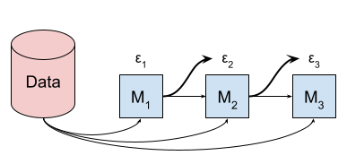
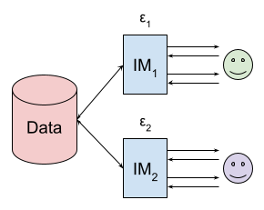
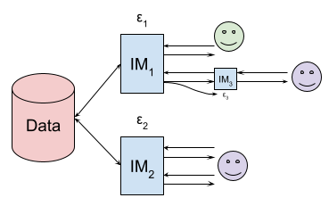

The composition theorem is a cornerstone of differential privacy literature. 
In its most basic formulation, it states that if two mechanisms \\(\mathcal{M}_1\\) and \\(\mathcal{M}_2\\) are respectively \\(\varepsilon_1\\)-DP and \\(\varepsilon_2\\)-DP, then the mechanism \\(\mathcal{M}\\) defined by \\(\mathcal{M}(D)=\left(\mathcal{M}_1(D),\mathcal{M}_2(D)\right)\\) is \\((\varepsilon_1+\varepsilon_2)\\)-DP.
A large body of work focused on proving extensions of this composition theorem.
These extensions are of two kinds.

- Some composition results apply to different *settings* than fixed mechanisms. 
- Other extend known results to *variants* of differential privacy.

In this blog post, we review existing results, and outline natural open questions appearing on both fronts.
We stumbled upon these open questions while building general-purpose differential privacy infrastructure, and we believe that solving them could have a positive impact on the usability and privacy/accuracy trade-offs provided by such tools.

### Different settings for composition

First, let's discuss what it means to compose two DP mechanisms.

#### Sequential composition

In the original composition result [[DMKS06]], all mechanisms \\(\mathcal{M}_1\\), \\(\mathcal{M}_2\\), etc., are fixed in advance, and have a predetermined privacy budget (resp. \\(\varepsilon_1\\), \\(\varepsilon_2\\), etc.).
They only take the sensitive data \\(D\\) as input: \\(\mathcal{M}_2\\) cannot see nor depend on \\(\mathcal{M}_1(D)\\).
This setting is typically called \emph{sequential composition}.

#### Adaptive composition

Shortly afterwards, the result was extended to a setting called *adaptive composition* [[DKMMN06]].
In this context, each mechanism can access the outputs of previous mechanisms: for example, \\(\mathcal{M}_2\\) takes as input not only the sensitive data \\(D\\), but also \\(\mathcal{M}_1(D)\\).
However, the privacy budget associated with each mechanism is still fixed.

#### Fully adaptive composition

A natural extension of adaptive composition consists in allowing the privacy budget of each mechanism to depend on previous outputs.
This setting is called *fully adaptive composition* [[RRUV16]].
It captures a setting in which a single analyst is interacting with a DP interface, and can change which queries to run and their budget based on past results.

Composition theorems in the fully adaptive setting are of two types.

- *Privacy filters* assume that the DP interface has a fixed, total budget, and will refuse to answer queries once that budget is exhausted.
- *Privacy odometers*, by contrast, allow the analyst to run arbitrarily many queries using as much budget as they want, and quantify the privacy loss over time.

Somewhat surprisingly, there are separation results between both types: one can obtain tighter composition theorems with privacy filters than privacy odometers.

#### Concurrent composition

This is, however, not the end of the story.
Fully adaptive composition captures a setting in which a *single* analyst interacts with a DP interface.
What if *multiple* analysts have access to this interface, each with their own budget?
*Concurrent composition* [[VW21]] captures this idea.
In this setting, the mechanisms that are being composed are *interactive* (we denote them by IM in the diagram below), and the analysts interacting with each mechanism can share results with each other, and adaptively decide which queries to run.
The goal is to quantify the total privacy budget cost, across analysts: do existing results extend to the composition of interactive mechanisms?

#### Fully concurrent composition?

In concurrent composition as defined in [[VW21]], the number of analysts and their respective privacy budget is fixed upfront.
This means that concurrent composition and fully adaptive composition results are incomparable.
This suggests an even more generic setting, which (to the best of our knowledge) has not been studied in the literature: a kind of concurrent composition, where the number of analysts and their budget is *not* predefined.
Let's call this *fully concurrent composition*.
In this setting, an analyst with a certain privacy budget would be able to spin off a new interactive mechanism, with an adaptively-chosen privacy budget, that can also be interacted with concurrently.

This setting might seem pointless — why would analysts want to do this? — but proving composition results in this context would help building DP interfaces that combine expressivity and conceptual simplicity.
To understand why, let's take a look at how [Tumult Analytics](https://tmlt.dev)[^1] allows users to use its parallel composition feature.

[^1]: Tumult Analytics is a differential privacy framework used by institutions such as the U.S. Census Bureau, the IRS, or the Wikimedia Foundation. It is developed by [Tumult Labs](https://tmlt.io), the employer of the author of this blog post.

Tumult Analytics has a concept of a *Session*, which is initialized on some sensitive data with a given privacy budget.
Users can submit queries to this Session using a query language implemented in Python.
Each query executed by the Session will consume part of the overall privacy budget, and return DP results.
The use can then examine these results to decide which queries to submit to the Session next, and with which privacy budget.
So far, this matches the fully adaptive setting, in its privacy filter formulation.

But Tumult Analytics also allows users to split their sensitive data depending on the value of an attribute, and perform different operations in each partition of the data.
With this feature, users can write algorithms that use *parallel composition*, which is very useful.
This partitioning operation takes a fraction of the privacy budget, and spins off *sub-Sessions* that each have access to a subset of the original data.
The following diagram visualizes an example of this process.

At the beginning, there is one Session with a privacy budget of \\(\varepsilon_1=3\\).
After the partitioning operation, there are now *three* Sessions: the original Session that has access to all the data and has a leftover privacy budget of \\(\varepsilon_1=2\\), and two sub-Sessions that each have access to a partition of the data and have a privacy budget of \\(\varepsilon_2=1\\).
The analyst using this interface can interact with any of these three Sessions, and interleave queries between each, in a fully interactive manner.
This means that even though there is a single user interacting with the data, the setting is similar to concurrent composition: each Session is an interactive object with a maximum privacy budget.
However, note that the privacy budget associated with each of the sub-Sessions could, in principle, depend on the result of past queries.
This suggests that we need composition results that take this into account, and capture the fully concurrent setting suggested above.

### Composition for variants of differential privacy

#### Existing results and natural questions

A large number of variants and extensions of differential privacy have been proposed in the literature.
In many cases, a benefit of these alternative definitions is to improve the privacy analysis of mechanisms that compose a large number of simpler primitives.
For example, the \\(n\\)-fold composition of \\(\varepsilon\\)-DP mechanisms is \\(n\varepsilon\\)-DP, but the \\(n\\)-fold composition of \\((\varepsilon,\delta)\\)-DP mechanisms is also \\((\varepsilon',\delta')\\)-DP, with \\(\varepsilon'\approx\sqrt{n}\varepsilon\\) and \\(\delta'\approx n\delta\\).
Machine learning applications often use the moments accountant to perform privacy accounting, relying on the composition property of Rényi DP [[Mir17], [ACGMMTZ16]].
Gaussian DP and its generalization \\(f\\)-DP [[DRS22]] are also used in this context [[BDLS20]].
Meanwhile, statistical use cases using the Gaussian mechanism often use zero-concentrated DP [[BS16]] (zCDP) for their privacy analysis [[Des21]]; the approximate version of this definition is also useful when queries are grouped by an unknown domain [[SDH23]].

It is thus natural to study the composition of these variants under the settings described in the previous section.
For many variants and composition settings, \emph{optimal} composition results have been proven.
We give an overview in the following table.

|----------------------------------------|----------------|--------------|--------------------|---------------
|                                        | **Sequential** | **Adaptive** | **Fully adaptive** | **Concurrent** 
|----------------------------------------|----------------|--------------|--------------------|---------------
| \\(\varepsilon\\)-DP                  | [[DMKS06]]     | [[DKMMN06]]  | [[RRUV16]]         | [[VW21]] 
| \\((\varepsilon,\delta)\\)-DP         | [[KOV15]]      | [[KOV15]]    | [[WRRW22]][^2]     | [[WRRW22], [Lyu22]]
| Gaussian DP                            | [[DRS22]]      | [[DRS22]]    | [[ST22]]           | [[VZ22]]
| \\(f\\)-DP                            | [[DRS22]]      | [[DRS22]]    |                    | [[VZ22]]
| \\((\alpha,\varepsilon)\\)-Rényi DP   | [[Mir17]]      | [[Mir17]]    | [[FZ21]]           | [[Lyu22]]
| \\(\rho\\)-zero-concentrated DP       | [[BS16]]       | [[BS16]]     | [[FZ21]]           | [[Lyu22]]
| \\(\delta\\)-approx. \\(\rho\\)-zCDP | [[BS16]]       | [[BS16]]     | [[WRRW22]]         | 

[^2]: Only asymptotically optimal for small \\(\varepsilon\\).

This summary already suggests a few natural open questions: it is not known whether the fully adaptive composition results for \\((\varepsilon,\delta)\\)-DP can be improved, there is no fully adaptive composition theorem for \\(f\\)-DP, or concurrent for \\((\rho,\delta)\\)-approximate zCDP.

#### Reordering mechanisms during the privacy analysis

Let's assume for a moment that the table above is completed, and that we have optimal composition theorems for all the variants of interest and all settings.
Consider an analyst using a differential privacy framework, and performing multiple operations in a fully adaptive way.
Some of these operations are using \\(\rho\\)-zCDP, others are \\((\varepsilon,\delta)\\)-DP, alternatively, with varying parameters.
How should the privacy accounting be done in such a scenario?

In the context of sequential composition, it would be natural to \emph{reorder} those mechanisms: consider the equivalent situation where all \\(\rho\\)-zCDP mechanisms occur first, and all \\((\varepsilon,\delta)\\)-DP mechanisms occur afterwards.
In this setting, the zCDP mechanisms can be first be composed using the zCDP composition rule.
The overall zCDP guarantee can then be converted to \\((\varepsilon,\delta)\\)-DP, and composed with the other \\((\varepsilon,\delta)\\)-DP guarantees.
This will lead to a tighter privacy analysis than converting every individual \\(\rho\\)-zCDP mechanism to \\((\varepsilon,\delta)\\)-DP, and composing those guarantees. 

However, we would need an additional theoretical result to perform this kind of reordering operation in a fully adaptive context: the fact that composition results exist for \\((\varepsilon,\delta)\\)-DP and \\(\rho\\)-zCDP does not mean they can be combined.
How to resolve this problem, and make it possible to use the same privacy accounting techniques in the sequential setting and in the fully adaptive or fully concurrent setting?
This leads to a natural open question: when performing the privacy analysis of a privacy filter, can one "reorder" the mechanisms when composing them?
Answering this positively would allow DP frameworks to implement tighter privacy accounting at a relatively low cost in complexity.
It might very well be that the answer to this open question is negative.
In that case, proving such a separation result would be of significant theoretical interest in the study of DP composition.

#### Composing privacy loss distributions

When we say that a mechanism is \\((\varepsilon,\delta)\\)-DP, or \\(\rho\\)-zCDP, we are giving a "global" bound on the privacy loss random variable, defined by:
\\[
    \mathcal{L}_{D,D'}(o) =
       \ln\left(\frac{\mathbb{P}\left[\mathcal{M}{D}=o\right]}{\mathbb{P}\left[\mathcal{M}{D'}=o\right]}\right)
\\]
for all neighboring inputs \\(D\\) and \\(D'\\).

An alternative approach to privacy accounting consists in \emph{fully} describing this random variable.
One approach to do this uses the formalism of \emph{privacy loss distributions}~\cite{sommer2018privacy} (PLDs).
The PLD of a mechanism is defined as:
\\[
    \omega(y) = \mathbb{P}_{o\sim\mathcal{M}{D}}{\mathcal{L}_{D,D'}(o)=y}.
\\]

In the sequential composition setting, PLDs can be used for tight privacy analysis. 
This relies on a conceptually simple result: if \\(\omega\\) is the PLD of \\(\mathcal{M}\\) and \\(\omega'\\) is the PLD of \\(\mathcal{M}'\\) on neighboring databases \\(D\\), \\(D'\\), then the PLD of the composition of \\(\mathcal{M}\\) and \\(\mathcal{M}'\\) is \\(\omega\ast\omega'\\), where \\(\ast\\) is the convolution operator.
Of course, when doing privacy accounting, we don't want \\(\omega\\) and \\(\omega'\\) to depend on the pair of databases, so we replace them by \emph{worst-case} PLDs, that are "larger" than all possible PLDs for neighboring databases.

Using PLDs for privacy accounting can be done numerically [[MM18], [KJH20], [KJPH21], [GLW21], [GKKM22], [DGKKM22]] or analytically [[ZDW22]].
This family of approaches is convenient because it is very generic: DP frameworks can use a tight upper bound PLD when known, and fall back to a worst-case PLD corresponding to \\(\varepsilon\\)-DP or \\((\varepsilon,\delta)\\)-DP when the mechanism is too complex.
Unfortunately, the composition result mentioned above has only been proven in the sequential composition setting [[MM18]].
Extending it to adaptive composition is straightforward, but extending it to the fully adaptive setting (with privacy filters) or the concurrent setting does not seem trivial.

This leads us to our last open question: can these privacy accounting techniques be used in the fully adaptive or concurrent settings?

### Summary

In this blog post, we gave a high-level overview of different settings and variants of composition theorems.
Along the way, we listed a number of natural open questions.

1. Can we define a setting that generalizes both fully adaptive composition and concurrent composition? What composition results hold in that setting?
1. Can we "fill in the blanks" among existing composition results? Namely, can we prove optimal composition results for \\((\varepsilon,\delta)\\)-DP and \\(f\\)-DP in the fully adaptive setting, and for \\((\varepsilon,\delta)\\)-approximate zCDP in the concurrent setting?
1. In the fully adaptive setting with privacy filters, can one reorder mechanisms when computing their cumulative privacy loss, to optimize the privacy accounting?
1. Can we prove fully adaptive and concurrent composition results for privacy accounting based on privacy loss distributions?

Progress on these open questions would either uncover surprising additional separation results, or enable usability and utility improvements to general-purpose DP infrastructure.
We're excited about both prospects!

[DMKS06]: https://link.springer.com/chapter/10.1007/11681878_14
[DKMMN06]: https://link.springer.com/chapter/10.1007/11761679_29
[RRUV16]: https://proceedings.neurips.cc/paper_files/paper/2016/hash/58c54802a9fb9526cd0923353a34a7ae-Abstract.html
[VW21]: https://arxiv.org/abs/2105.14427
[Mir17]: https://ieeexplore.ieee.org/abstract/document/8049725
[ACGMMTZ16]: https://research.google/pubs/pub45428/
[DRS22]: https://academic.oup.com/jrsssb/article/84/1/3/7056089
[BDLS20]: https://arxiv.org/abs/1911.11607
[BS16]: https://link.springer.com/chapter/10.1007/978-3-662-53641-4_24
[Des21]: https://desfontain.es/privacy/real-world-differential-privacy.html
[SDH23]: https://arxiv.org/abs/2301.01998
[KOV15]: https://proceedings.mlr.press/v37/kairouz15.html
[WRRW22]: https://proceedings.mlr.press/v202/whitehouse23a.html
[Lyu22]: https://proceedings.neurips.cc/paper_files/paper/2022/hash/3f52b555967a95ee850fcecbd29ee52d-Abstract-Conference.html
[ST22]: https://arxiv.org/abs/2210.17520
[VZ22]: https://arxiv.org/abs/2207.08335
[FZ21]: https://proceedings.neurips.cc/paper/2021/hash/ec7f346604f518906d35ef0492709f78-Abstract.html
[MM18]: https://eprint.iacr.org/2017/1034
[KJH20]: https://arxiv.org/abs/2102.12412
[KJPH21]: http://proceedings.mlr.press/v130/koskela21a.html
[GLW21]: https://proceedings.neurips.cc/paper_files/paper/2021/hash/6097d8f3714205740f30debe1166744e-Abstract.html
[GKKM22]: https://proceedings.mlr.press/v162/ghazi22a.html
[DGKKM22]: https://arxiv.org/abs/2207.04380
[ZDW22]: https://proceedings.mlr.press/v151/zhu22c.html
